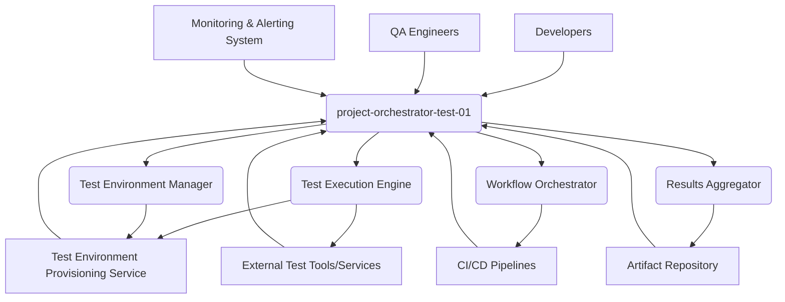
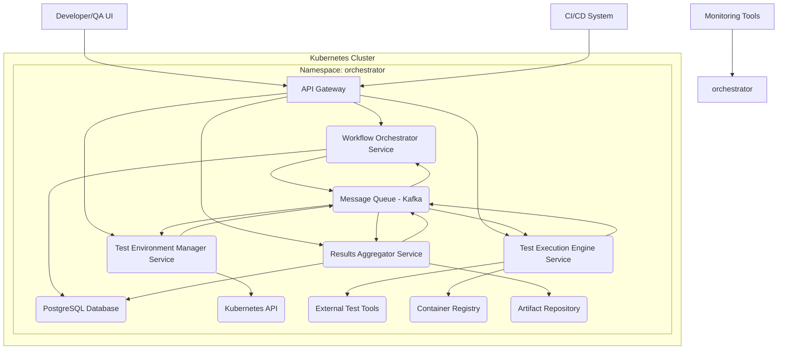

# System Architecture Document (SAD)
**Project:** project-orchestrator-test-01
**Version:** 1.0.0
**Date:** 2023-10-27
**Architect:** AI Architect

## 1. Executive Summary

The core of the system comprises several key microservices: a Workflow Orchestrator, a Test Environment Manager, a Test Execution Engine, and a Results Aggregator. These services will communicate primarily via message queues, promoting loose coupling and independent scalability. The technology stack will be built around modern, open-source technologies, including Kubernetes for container orchestration, PostgreSQL for relational data storage, Redis for caching and message brokering, and a RESTful API gateway for external access. This approach ensures a high degree of interoperability and allows for future expansion and integration with existing CI/CD pipelines and testing tools. The system aims to reduce the time and cost associated with test environment setup and test execution by up to 40%, significantly improving the overall software development lifecycle.

Key architectural decisions include:
*   **Microservices Architecture:** Decomposing the system into small, independent services for enhanced scalability, maintainability, and fault isolation.
*   **Asynchronous Communication:** Utilizing message queues (e.g., Kafka or RabbitMQ) for inter-service communication to ensure resilience and decouple service dependencies.
*   **Containerization and Orchestration:** Employing Docker for containerization and Kubernetes for orchestration to provide a scalable, portable, and self-healing deployment environment.
*   **API Gateway:** Implementing an API Gateway (e.g., Kong or Traefik) to manage external access, provide a unified entry point, and handle cross-cutting concerns like authentication and rate limiting.
*   **Data Persistence:** Using PostgreSQL for structured data (test configurations, execution history) and potentially a NoSQL database (e.g., MongoDB) for semi-structured or large volumes of test logs.

Technology stack summary:
*   **Backend Services:** Go, Python, Java (selected based on team expertise and specific service requirements)
*   **Containerization:** Docker
*   **Orchestration:** Kubernetes
*   **Message Broker:** Kafka
*   **Database:** PostgreSQL, Redis
*   **API Gateway:** Traefik
*   **Monitoring & Logging:** Prometheus, Grafana, ELK Stack

## 2. Architecture Goals and Constraints

The primary goal of project-orchestrator-test-01 is to provide a highly available, scalable, and secure platform for managing and executing automated testing workflows. We aim to achieve significant improvements in testing efficiency, reducing the time and resources required for test environment provisioning and test execution.

**Quality Attributes:**

*   **Performance:** The system must be able to orchestrate and execute a high volume of tests concurrently with minimal latency.
    *   **KPI:** Average test execution start time: < 5 seconds for 95% of requests.
    *   **KPI:** Maximum test execution completion time: < 10 minutes for standard test suites (e.g., unit and integration tests).
    *   **Rationale:** Slow test execution directly impacts development velocity. Minimizing this latency ensures developers receive feedback quickly, enabling faster iteration cycles.
*   **Scalability:** The system must scale horizontally to accommodate an increasing number of users, test suites, and concurrent test executions.
    *   **KPI:** System throughput: Capable of handling 1000 concurrent test executions per minute, with the ability to scale to 5000 within 15 minutes.
    *   **KPI:** Resource utilization: Maintain CPU and memory utilization below 70% under peak load, allowing for headroom.
    *   **Rationale:** As the project grows and more teams adopt the orchestrator, the demand for testing resources will increase. The architecture must be able to meet this demand without performance degradation.
*   **Reliability & Availability:** The system must be highly available, with minimal downtime.
    *   **KPI:** Uptime: 99.95% availability.
    *   **KPI:** Mean Time Between Failures (MTBF): > 1000 hours.
    *   **Rationale:** Testing is a critical part of the development pipeline. Any downtime can halt development progress and delay releases.
*   **Security:** The system must protect sensitive test data, credentials, and intellectual property.
    *   **KPI:** Number of security vulnerabilities identified and patched: 0 critical vulnerabilities per quarter.
    *   **KPI:** Compliance with industry security standards (e.g., OWASP Top 10): 100% adherence.
    *   **Rationale:** Test environments often contain sensitive data or access to production-like systems. Robust security measures are paramount to prevent breaches and maintain trust.
*   **Maintainability:** The system should be easy to update, debug, and extend.
    *   **KPI:** Mean Time To Repair (MTTR): < 30 minutes for critical incidents.
    *   **KPI:** Code complexity (Cyclomatic Complexity): Average < 10 for core modules.
    *   **Rationale:** A maintainable system reduces operational overhead and allows for faster feature development and bug fixing.

**Business Constraints:**

*   **Budget:** The project must be delivered within the allocated budget of $X million. This influences technology choices and the extent of custom development versus off-the-shelf solutions.
*   **Timeline:** The initial Minimum Viable Product (MVP) must be delivered within 6 months. This constraint dictates the scope of features for the initial release.
*   **Team Expertise:** The development team has strong expertise in Go, Python, and Kubernetes. Technology choices should leverage this existing knowledge base where possible.
*   **Integration with Existing CI/CD:** The orchestrator must seamlessly integrate with existing CI/CD pipelines (e.g., Jenkins, GitLab CI) to trigger test runs automatically.

**Technical Constraints:**

*   **Cloud Provider:** The system will be deployed on AWS. This dictates the choice of managed services and infrastructure components.
*   **Open Source Preference:** A strong preference for open-source technologies to avoid vendor lock-in and leverage community support.
*   **Existing Infrastructure:** Must be compatible with existing internal networking and security policies.

## 3. System Context

The project-orchestrator-test-01 system operates within a broader ecosystem, interacting with various internal and external entities. It acts as a central hub for managing and executing automated tests, bridging the gap between development, QA, and operations.

**Actors and their interactions:**

*   **Developers:** Trigger test runs, define test configurations, and analyze test results to identify and fix defects. They interact with the system via APIs or a user interface to initiate tests and retrieve reports.
*   **QA Engineers:** Define test strategies, create test suites, manage test environments, and analyze detailed test reports. They are primary users of the system's management console.
*   **CI/CD Pipelines:** Integrate with the orchestrator to automatically trigger test executions upon code commits or build completions. This ensures continuous testing throughout the development lifecycle. For example, a GitLab CI pipeline might call the orchestrator's API to start a regression test suite after a successful build.
*   **Test Environment Provisioning Service:** Responsible for creating and managing the underlying infrastructure (e.g., virtual machines, containers) where tests are executed. The orchestrator requests environments from this service. An example interaction: The orchestrator requests a Kubernetes cluster with specific node configurations for a performance test.
*   **Monitoring & Alerting System:** Receives metrics and logs from the orchestrator to track system health, performance, and potential issues. Alerts are generated for critical events. For instance, if the orchestrator's response time exceeds a predefined threshold, an alert is sent to the operations team.
*   **Artifact Repository:** Stores test artifacts such as build logs, test reports, and captured data. The orchestrator pushes generated artifacts to this repository. An example: After a test run, the detailed JUnit XML report is uploaded to an Artifactory repository.
*   **External Test Tools/Services:** The orchestrator can integrate with various external tools like Selenium Grid, Appium, or specialized performance testing tools (e.g., JMeter) to execute tests. The orchestrator acts as a dispatcher, sending test jobs to these services.
*   **project-orchestrator-test-01 System:** This is the core system being designed, encompassing the Workflow Orchestrator, Test Environment Manager, Test Execution Engine, and Results Aggregator.

The system's primary function is to abstract away the complexities of test environment setup and test execution, providing a unified and efficient interface for all stakeholders. This allows teams to focus on writing effective tests rather than managing infrastructure.

## 4. Container Architecture

The container architecture for project-orchestrator-test-01 is designed around a microservices pattern, leveraging Docker for containerization and Kubernetes for orchestration. This approach ensures scalability, resilience, and efficient resource utilization. Each microservice is packaged as a Docker image, allowing for consistent deployment across different environments. Kubernetes manages the deployment, scaling, and networking of these containers.

**Key Containerized Services:**

*   **API Gateway (Traefik):** Acts as the single entry point for all external requests. It handles request routing, authentication, rate limiting, and SSL termination. It routes incoming requests to the appropriate microservice.
    *   **Example:** A developer's request to start a new test run is received by the API Gateway, which then forwards it to the Workflow Orchestrator Service.
*   **Workflow Orchestrator Service:** Manages the lifecycle of test workflows. It receives requests to start tests, breaks them down into individual tasks, and publishes messages to the message queue for other services to consume.
    *   **Example:** Receives a request to run a regression suite, creates tasks for environment setup, test execution, and result aggregation, and publishes these tasks as messages.
*   **Test Environment Manager Service:** Responsible for provisioning and de-provisioning test environments. It interacts with the Kubernetes API to create or destroy pods, deployments, or other Kubernetes resources as needed.
    *   **Example:** Consumes a "provision environment" message from the queue and uses the Kubernetes API to spin up a new set of pods configured for a specific test type (e.g., a Selenium Grid setup).
*   **Test Execution Engine Service:** Manages the execution of individual test tasks. It pulls tasks from the message queue, launches test containers (potentially using Kubernetes Jobs or custom runners), and reports execution status.
    *   **Example:** Pulls a "run integration test" message, launches a Docker container with the test code and dependencies, and reports success or failure back to the Results Aggregator.
*   **Results Aggregator Service:** Collects test results from the Test Execution Engine, processes them, stores them in the database, and makes them available for reporting.
    *   **Example:** Receives test execution status updates, aggregates them into a comprehensive test report, and stores the report in the PostgreSQL database.
*   **Message Queue (Kafka):** Provides asynchronous communication between microservices. This decouples services, allowing them to scale independently and improving fault tolerance.
    *   **Example:** The Workflow Orchestrator publishes a "start test execution" message, and the Test Execution Engine consumes it.
*   **PostgreSQL Database:** Stores persistent data, including workflow definitions, test configurations, execution history, and aggregated results.
    *   **Example:** Stores the configuration details for a specific test suite, including the target environment and the list of test cases.
*   **Kubernetes API:** The interface used by the Test Environment Manager to manage cluster resources.
*   **External Test Tools:** These are services or applications that the Test Execution Engine might interact with, such as Selenium, Appium, or custom testing frameworks.
*   **Container Registry:** Stores Docker images for test execution containers.
*   **Artifact Repository:** Stores generated test artifacts like logs and reports.
*   **Developer/QA UI:** A web-based interface for users to interact with the system.
*   **CI/CD System:** External systems that trigger test runs.
*   **Monitoring Tools:** Collect metrics and logs from all services for observability.

This containerized architecture ensures that each component can be scaled independently based on demand. For instance, if test execution becomes a bottleneck, more instances of the Test Execution Engine can be automatically provisioned by Kubernetes.

## 5. Component Architecture

The component architecture breaks down the system into logical functional units, detailing their responsibilities, interfaces, and dependencies. This provides a granular view of how the system operates internally.

**Component Responsibilities:**

*   **Workflow Orchestrator:**
    *   **Responsibility:** Manages the end-to-end lifecycle of test workflows. This includes receiving requests to start workflows, decomposing them into smaller tasks, scheduling these tasks, and monitoring their progress. It acts as the central brain for initiating and coordinating test runs.
    *   **Example:** When a developer commits code, the CI/CD pipeline triggers the orchestrator to run a full regression suite. The orchestrator then creates tasks for environment setup, test execution, and result aggregation.
*   **Test Environment Manager:**
    *   **Responsibility:** Handles the provisioning and de-provisioning of test environments. It abstracts the underlying infrastructure (e.g., Kubernetes, cloud VMs) and ensures that environments are configured correctly for specific test needs.
    *   **Example:** Upon receiving a request from the orchestrator, it provisions a Kubernetes namespace with specific resource limits and deploys a Selenium Grid instance for UI testing.
*   **Test Execution Engine:**
    *   **Responsibility:** Executes individual test tasks. It is responsible for launching test containers, managing their lifecycle, and reporting the outcome (success, failure, errors) of each test.
    *   **Example:** It pulls a task to run a specific API test, spins up a Docker container with the test code and necessary dependencies, executes the test, and reports the results.
*   **Results Aggregator:**
    *   **Responsibility:** Collects, processes, and stores test results from the Test Execution Engine. It aggregates results into meaningful reports, stores historical data, and provides an interface for querying and analyzing test outcomes.
    *   **Example:** Receives individual test results, combines them into a suite-level report, stores this report in the database, and makes it accessible via an API for the UI.
*   **Message Bus (Kafka):**
    *   **Responsibility:** Facilitates asynchronous communication between components. It acts as a buffer and a reliable delivery mechanism for messages, ensuring that components can operate independently.
    *   **Example:** The Workflow Orchestrator publishes a "provision_environment" message, and the Test Environment Manager consumes it.
*   **Data Store (PostgreSQL):**
    *   **Responsibility:** Provides persistent storage for workflow definitions, test configurations, execution history, and aggregated results.
    *   **Example:** Stores the schema for a test workflow, including the sequence of steps and their dependencies.
*   **API Gateway (Traefik):**
    *   **Responsibility:** Manages external access to the system. It handles request routing, authentication, authorization, rate limiting, and SSL termination.
    *   **Example:** Authenticates incoming API requests from CI/CD pipelines and routes them to the appropriate backend service.

**Interface Definitions:**

*   **Workflow Orchestrator <-> Message Bus:**
    *   `publish(topic: string, message: object)`: Publishes a message to a specified Kafka topic.
    *   `subscribe(topic: string, handler: function)`: Subscribes to a Kafka topic and invokes a handler for each received message.
*   **Test Environment Manager <-> Message Bus:**
    *   `subscribe(topic: "provision_environment", handler: function)`: Subscribes to the environment provisioning topic.
    *   `publish(topic: "environment_provisioned", message: object)`: Publishes a message indicating environment status.
*   **Test Execution Engine <-> Message Bus:**
    *   `subscribe(topic: "execute_test", handler: function)`: Subscribes to the test execution topic.
    *   `publish(topic: "test_execution_result", message: object)`: Publishes test outcome details.
*   **Results Aggregator <-> Message Bus:**
    *   `subscribe(topic: "test_execution_result", handler: function)`: Subscribes to test result messages.
    *   `publish(topic: "workflow_completed", message: object)`: Publishes a message when a workflow is fully processed.
*   **Workflow Orchestrator <-> Data Store:**
    *   `saveWorkflowDefinition(definition: object)`: Saves a workflow definition.
    *   `getWorkflowDefinition(id: string)`: Retrieves a workflow definition.
    *   `saveTask(task: object)`: Saves a task associated with a workflow.
*   **Results Aggregator <-> Data Store:**
    *   `saveTestResult(result: object)`: Saves individual test results.
    *   `saveWorkflowReport(report: object)`: Saves aggregated workflow reports.
    *   `getWorkflowHistory(workflowId: string)`: Retrieves historical data for a workflow.
*   **API Gateway <-> Backend Services:**
    *   RESTful APIs for each service (e.g., `POST /workflows`, `GET /workflows/{id}/results`).

**Dependency Relationships:**

*   The **Workflow Orchestrator** depends on the **Message Bus** to distribute tasks and the **Data Store** to persist workflow and task information.
*   The **Test Environment Manager** depends on the **Message Bus** to receive provisioning requests and the **Kubernetes API** (implicitly, via client libraries) to manage resources. It also publishes status updates back via the **Message Bus**.
*   The **Test Execution Engine** depends on the **Message Bus** to receive execution tasks and publishes results back. It may also depend on **Container Registry** to pull test images and **External Test Tools**.
*   The **Results Aggregator** depends on the **Message Bus** to receive test results and the **Data Store** to persist them.
*   The **API Gateway** depends on all backend services to route requests.

## 6. Deployment Architecture

The deployment architecture outlines how the system will be deployed and managed in its target environment, focusing on infrastructure, environments, and scaling strategies.

**Infrastructure Components:**

*   **Kubernetes Cluster (AWS EKS):** The core orchestration platform. It will manage the deployment, scaling, and networking of all microservices and test execution containers.
    *   **Example:** A multi-node EKS cluster will be provisioned with appropriate instance types (e.g., `m5.large` for general services, `c5.xlarge` for compute-intensive test execution).
*   **Managed Kafka Cluster (AWS MSK):** Provides a scalable and reliable message broker for asynchronous communication between microservices.
    *   **Example:** A Kafka cluster with multiple brokers and partitions will be configured to handle high message throughput.
*   **Managed PostgreSQL Database (AWS RDS):** A highly available and durable relational database for storing critical system data.
    *   **Example:** An RDS instance with multi-AZ deployment for high availability and automated backups.
*   **Managed Redis Cache (AWS ElastiCache):** Used for caching frequently accessed data and potentially for distributed locking or session management.
    *   **Example:** An ElastiCache Redis cluster for caching test configurations to reduce database load.
*   **Container Registry (AWS ECR):** Stores Docker images for all microservices and test execution containers.
    *   **Example:** ECR repositories will be created for each microservice image and for custom test runner images.
*   **Object Storage (AWS S3):** Used for storing larger artifacts like test logs, screenshots, and video recordings.
    *   **Example:** An S3 bucket configured with lifecycle policies to manage storage costs for historical test artifacts.
*   **Load Balancer (AWS ELB/ALB):** Distributes incoming traffic across multiple instances of the API Gateway.
    *   **Example:** An Application Load Balancer (ALB) will be placed in front of the API Gateway pods to ensure high availability and distribute traffic.
*   **Monitoring and Logging Stack (Prometheus, Grafana, ELK):** Deployed within the Kubernetes cluster or as managed services to collect metrics, logs, and traces for system observability.
    *   **Example:** Prometheus will scrape metrics from all microservices, and Grafana will be used for dashboarding. Elasticsearch, Logstash, and Kibana (ELK) will be used for centralized log management.

**Deployment Environments:**

*   **Development Environment:** A local or cloud-based environment for developers to test individual services and integrations. This might involve `docker-compose` or a small Kubernetes cluster.
    *   **Example:** Developers might run services locally using Docker Desktop and connect to a shared development Kafka and PostgreSQL instance.
*   **Staging Environment:** A production-like environment used for integration testing, performance testing, and user acceptance testing (UAT) before deploying to production. It mirrors the production infrastructure as closely as possible.
    *   **Example:** A dedicated Kubernetes cluster on AWS, with similar instance types and configurations as production, but with reduced capacity.
*   **Production Environment:** The live environment where the system serves its intended users. It will be highly available, scalable, and secured.
    *   **Example:** A production-grade EKS cluster with auto-scaling enabled, multi-AZ RDS for the database, and MSK for Kafka.

**Scaling Strategies:**

*   **Horizontal Pod Autoscaling (HPA):** Kubernetes HPA will be configured for stateless microservices (e.g., Workflow Orchestrator, Test Execution Engine) to automatically scale the number of pods based on CPU or memory utilization.
    *   **Example:** The Test Execution Engine HPA will be configured to scale from 3 to 50 pods when average CPU utilization exceeds 70%.
*   **Cluster Autoscaler:** The Kubernetes Cluster Autoscaler will automatically adjust the number of worker nodes in the EKS cluster based on pending pods that cannot be scheduled due to resource constraints.
    *   **Example:** If HPA scales up the Test Execution Engine pods and there are no available nodes, the Cluster Autoscaler will provision new EC2 instances.
*   **Managed Service Scaling:** AWS managed services like RDS and MSK offer built-in scaling capabilities, such as read replicas for RDS or adding more brokers to MSK.
    *   **Example:** The PostgreSQL RDS instance can be scaled up by increasing its instance class or adding read replicas to handle increased read load from the Results Aggregator.
*   **Message Queue Scaling:** Kafka's distributed nature allows for scaling by adding more brokers and partitions to handle increased message throughput.
    *   **Example:** If message processing latency increases, new Kafka brokers can be added to the MSK cluster.
*   **Stateless Service Design:** All microservices are designed to be stateless, meaning they do not store session information locally. This allows any instance of a service to handle any request, simplifying scaling.

## 7. Security Architecture

The security architecture is designed to protect the project-orchestrator-test-01 system and its data from unauthorized access, modification, or disclosure. It encompasses authentication, authorization, data protection, and network security measures.

**Authentication and Authorization:**

*   **API Gateway Authentication:** All incoming API requests will be authenticated at the API Gateway. This will be achieved using a combination of API keys for programmatic access (e.g., from CI/CD pipelines) and OAuth 2.0/OpenID Connect for user-based authentication (e.g., from the UI).
    *   **Example:** A CI/CD pipeline will use a pre-generated API key to authenticate its requests to trigger test runs. A QA engineer logging into the UI will authenticate via an OAuth provider (e.g., Okta, AWS Cognito).
*   **Role-Based Access Control (RBAC):** Within the system, RBAC will be implemented to ensure users and services only have access to the resources and actions they are authorized for. Roles will be defined (e.g., Administrator, Test Manager, Test Runner) with specific permissions.
    *   **Example:** A "Test Manager" role might have permissions to create and manage test workflows, while a "Test Runner" role only has permissions to execute assigned test tasks.
*   **Service-to-Service Authentication:** Microservices will authenticate each other using mechanisms like mTLS (mutual TLS) or JWT (JSON Web Tokens) to ensure secure communication within the cluster.
    *   **Example:** The Test Execution Engine might present a JWT signed by the Workflow Orchestrator to prove its identity before consuming tasks from the message queue.
*   **Secrets Management:** Sensitive information such as database credentials, API keys, and certificates will be managed securely using a dedicated secrets management solution (e.g., HashiCorp Vault, AWS Secrets Manager). These secrets will be injected into pods at runtime, not stored in code or configuration files.
    *   **Example:** Database connection strings will be retrieved from AWS Secrets Manager by the Kubernetes pods at startup.

**Data Protection:**

*   **Data Encryption at Rest:** All sensitive data stored in databases (PostgreSQL) and object storage (S3) will be encrypted at rest using industry-standard encryption algorithms (e.g., AES-256). AWS KMS will be used for managing encryption keys.
    *   **Example:** The PostgreSQL RDS instance will have encryption enabled, and data stored in the S3 bucket for test artifacts will also be encrypted.
*   **Data Encryption in Transit:** All data transmitted between services, and between clients and the API Gateway, will be encrypted using TLS/SSL. This includes communication over the message queue and database connections.
    *   **Example:** All HTTP requests to the API Gateway will be over HTTPS, and connections to the PostgreSQL database will use SSL.
*   **Data Masking and Anonymization:** Where applicable, sensitive test data within test results or logs will be masked or anonymized to prevent exposure of personally identifiable information (PII) or confidential business data.
    *   **Example:** If test logs contain user email addresses, these will be replaced with a placeholder like `[REDACTED_EMAIL]` before being stored.
*   **Regular Backups and Disaster Recovery:** Regular backups of the PostgreSQL database will be performed and stored securely. A disaster recovery plan will be in place to restore the system in case of a catastrophic failure.
    *   **Example:** Daily automated backups of the RDS instance will be stored in S3, with a retention policy of 30 days.

**Network Security:**

*   **Network Segmentation:** The Kubernetes cluster will be segmented using Network Policies to restrict communication between pods. Only necessary communication paths will be allowed.
    *   **Example:** The Test Execution Engine pods will only be allowed to communicate with the Message Bus and the Artifact Repository, not directly with the PostgreSQL database.
*   **Firewall Rules:** AWS Security Groups and Network ACLs will be configured to control inbound and outbound traffic to the cluster and managed services.
    *   **Example:** The EKS cluster's security group will only allow inbound traffic on specific ports (e.g., 443 for the ALB) from trusted sources.
*   **Intrusion Detection and Prevention:** Network traffic will be monitored for suspicious activity using AWS GuardDuty or similar services.
    *   **Example:** GuardDuty will analyze VPC flow logs and CloudTrail logs to detect potential threats like unusual API calls or network reconnaissance.
*   **Vulnerability Scanning:** Container images and running containers will be regularly scanned for known vulnerabilities using tools like AWS ECR Image Scanning or Trivy.
    *   **Example:** ECR will automatically scan all pushed images for vulnerabilities, and alerts will be generated for any critical findings.

## 8. Data Architecture

The data architecture defines how data is modeled, stored, managed, and flows through the project-orchestrator-test-01 system. It ensures data integrity, consistency, and efficient access.

**Data Models:**

The system will primarily utilize a relational data model for structured data, stored in PostgreSQL. Key entities include:

*   **Workflow:** Represents a defined sequence of test execution steps.
    *   `workflow_id` (UUID, PK)
    *   `name` (VARCHAR)
    *   `description` (TEXT)
    *   `created_at` (TIMESTAMP)
    *   `updated_at` (TIMESTAMP)
    *   `version` (INTEGER)
*   **WorkflowStep:** Represents an individual step within a workflow.
    *   `step_id` (UUID, PK)
    *   `workflow_id` (UUID, FK to Workflow)
    *   `name` (VARCHAR)
    *   `type` (VARCHAR - e.g., "environment_provision", "execute_test", "aggregate_results")
    *   `configuration` (JSONB - specific parameters for the step)
    *   `order` (INTEGER)
*   **TestExecution:** Represents a single instance of a workflow being executed.
    *   `execution_id` (UUID, PK)
    *   `workflow_id` (UUID, FK to Workflow)
    *   `status` (VARCHAR - e.g., "running", "completed", "failed")
    *   `start_time` (TIMESTAMP)
    *   `end_time` (TIMESTAMP)
    *   `triggered_by` (VARCHAR - e.g., "CI_PIPELINE", "USER_ID")
*   **TestResult:** Stores the outcome of an individual test case or task within an execution.
    *   `result_id` (UUID, PK)
    *   `execution_id` (UUID, FK to TestExecution)
    *   `step_id` (UUID, FK to WorkflowStep)
    *   `test_name` (VARCHAR)
    *   `status` (VARCHAR - e.g., "passed", "failed", "skipped")
    *   `duration_ms` (INTEGER)
    *   `error_message` (TEXT)
    *   `log_url` (VARCHAR - link to artifact in S3)
    *   `timestamp` (TIMESTAMP)
*   **EnvironmentConfiguration:** Details about specific test environments.
    *   `config_id` (UUID, PK)
    *   `name` (VARCHAR)
    *   `type` (VARCHAR - e.g., "kubernetes", "vm")
    *   `specifications` (JSONB - e.g., Kubernetes resource requests, VM image details)

**Data Flow:**

1.  **Workflow Definition:** A user or CI/CD pipeline defines a workflow, specifying a sequence of steps. This definition is saved in the **PostgreSQL** database via the **Workflow Orchestrator**.
2.  **Test Execution Initiation:** A request to start a workflow is received by the **Workflow Orchestrator**. It creates a `TestExecution` record in **PostgreSQL** and publishes a "provision_environment" message to **Kafka**.
3.  **Environment Provisioning:** The **Test Environment Manager** consumes the "provision_environment" message, retrieves environment specifications from **PostgreSQL**, provisions the environment (e.g., via Kubernetes API), and publishes an "environment_provisioned" message to **Kafka**.
4.  **Test Task Distribution:** The **Workflow Orchestrator** consumes the "environment_provisioned" message, creates "execute_test" tasks for each relevant test step, and publishes them to **Kafka**.
5.  **Test Execution:** The **Test Execution Engine** consumes "execute_test" messages, launches test containers, executes the tests, and uploads any generated logs or artifacts to **S3**. It then publishes "test_execution_result" messages to **Kafka**.
6.  **Result Aggregation:** The **Results Aggregator** consumes "test_execution_result" messages. It updates the `TestResult` records in **PostgreSQL**, aggregates results into a workflow report, and saves it. It also stores links to artifacts in **S3**.
7.  **Reporting:** Users can query the **PostgreSQL** database via the **API Gateway** and the UI to view workflow history, test results, and reports. Artifacts can be accessed directly from **S3** using the provided URLs.

**Data Governance:**

*   **Data Ownership:** The Data Engineering team is responsible for the overall data architecture and governance policies. Specific data domains (e.g., workflow definitions, test results) are owned by the project team.
*   **Data Quality:** Data validation will be implemented at the point of entry for all data stored in PostgreSQL. This includes type checking, format validation, and ensuring referential integrity. Automated data quality checks will be run periodically.
    *   **Example:** When saving a `TestResult`, the system will validate that `execution_id` exists and that `status` is one of the allowed values ("passed", "failed", "skipped").
*   **Data Retention:** Policies will be defined for data retention in PostgreSQL and S3. Older test results and artifacts may be archived or deleted to manage storage costs and comply with regulations.
    *   **Example:** Test execution history older than 1 year will be moved to a cold storage tier in S3, and then deleted after 2 years.
*   **Data Access Control:** Access to the PostgreSQL database and S3 buckets will be strictly controlled based on the principle of least privilege, enforced through IAM roles and database user permissions.
    *   **Example:** The Results Aggregator service account will have read/write access to the `test_results` table, while the UI service account will only have read access.
*   **Data Lineage:** Efforts will be made to track data lineage, understanding where data originates, how it is transformed, and where it is used. This is crucial for debugging and auditing.
    *   **Example:** The `log_url` in the `TestResult` table provides a direct link to the raw logs in S3, enabling traceability. The `triggered_by` field in `TestExecution` indicates the source of the test run.